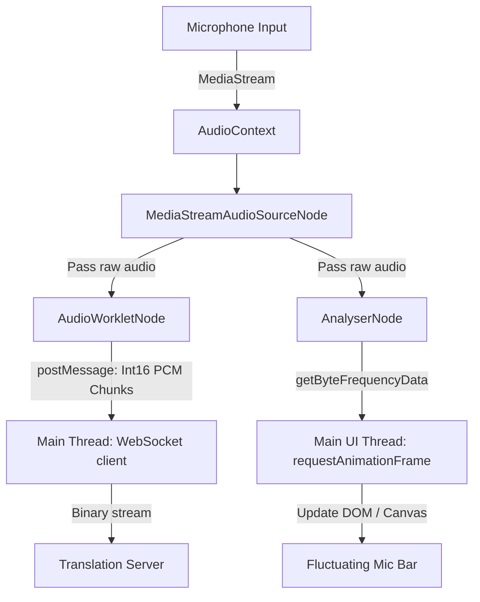

# Futuristic Voice Capture & Visualizer Design

This document details the architectural flow for real-time voice capture using standard modern APIs (**Web Audio API** + **AudioWorklet**), along with the design layout and real-time visualization strategy for the user interface.

## UI Design Concepts & Visual Mockup

The interface is built around a sleek, dark-themed cyberpunk aesthetic with glassmorphism overlays and neon orange/amber accent highlights.

### Key UI Elements
1. **Interactive Glow Button**: Transitions from a pulsing solid orange "Start Talking" state to a "Listening..." state.
2. **Dynamic Microphone Visualizer**: A centralized microphone indicator containing fluctuating energy levels that map to real-time voice intensity.

---

## Architectural Flow: Audio Ingestion & Visualization

To deliver a high-performance system without UI thread blocking, the workload is distributed across the **Audio Thread (AudioWorklet)**, **Browser Native Thread (AnalyserNode)**, and the **Main UI Thread (JS)**.

### 1. The AudioWorklet (Background Audio Thread)
*   **Role**: Handles high-frequency chunking, conversion to 16-bit Int16 PCM, downsampling to 16kHz, and posting binary data chunks back to the main thread.
*   **Why**: Because audio sampling operates at standard schedules (e.g., every 128 frames at 48kHz, which is ~2.6ms), handling this data directly on the main thread would cause frame-skips. The Worklet ensures zero interruptions to the stream sent to the WebSocket.

### 2. The AnalyserNode (Native Audio Analysis)
*   **Role**: Computes FFT (Fast Fourier Transform) frequency-domain data to calculate the real-time audio energy.
*   **Why**: Connecting the source to an `AnalyserNode` allows the browser to compute visual metrics natively (implemented in fast, compiled browser C++ code).
*   **How we compute the intensity (fluctuating bar)**:
    1.  The main thread runs a `requestAnimationFrame` loop.
    2.  It queries the `AnalyserNode` using `analyser.getByteFrequencyData(dataArray)` or calculates the **RMS (Root Mean Square)** of the time-domain data:
        $$\text{RMS} = \sqrt{\frac{1}{N} \sum_{i=1}^{N} x_i^2}$$
    3.  This value is mapped directly to CSS variables (e.g., `--volume-height` or SVG path dimensions) to visually expand the orange indicator inside the microphone button.

---

## Technical Flow Steps

1. **User Clicks "Start Talking"**:
   *   Browser initializes the `AudioContext` (must be triggered by a user gesture).
   *   Requests microphone stream via `navigator.mediaDevices.getUserMedia({ audio: true })`.
   *   Loads the `AudioWorklet` processor file (`audioContext.audioWorklet.addModule(...)`).
   *   Creates and connects nodes: `SourceNode -> AnalyserNode` and `SourceNode -> AudioWorkletNode`.
2. **Active Streaming**:
   *   The `AudioWorklet` buffers input samples, compresses/formats them, and fires a message to the main script.
   *   The main script sends the payload raw to the Translation WebSocket.
   *   Concurrently, `requestAnimationFrame` queries the `AnalyserNode` to animate the fluctuating microphone icon.
3. **User Stops or Interrupted**:
   *   `audioContext.suspend()` or `audioContext.close()` is called.
   *   WebSocket connection is closed or set to idle.
   *   Microphone visualizer drops back to 0.
